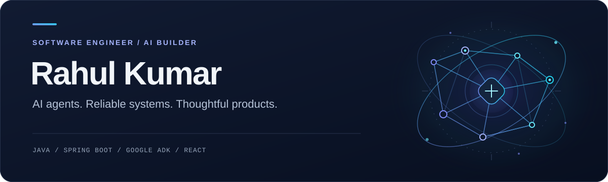

<picture>
  <source media="(prefers-color-scheme: dark)" srcset="./dark.svg">
  <source media="(prefers-color-scheme: light)" srcset="./light.svg">
  
</picture>

  <strong>Software Engineer @ Lloyds Technology Centre</strong> 
  Building at the intersection of AI, backend engineering, and full-stack products.

  <a href="https://rahul-portfolio-psi-sand.vercel.app/"><strong>Explore my portfolio ↗</strong></a>
  &nbsp; / &nbsp;
  <a href="https://www.linkedin.com/in/rahul-kumar-9066bb216/">LinkedIn</a>
  &nbsp; / &nbsp;
  <a href="mailto:rahul.kumar800745@gmail.com">Say hello</a>

  <a href="#about">About</a> &nbsp;·&nbsp;
  <a href="#selected-projects">Projects</a> &nbsp;·&nbsp;
  <a href="#engineering-stack">Stack</a> &nbsp;·&nbsp;
  <a href="#experience">Experience</a> &nbsp;·&nbsp;
  <a href="#connect">Connect</a>

---

## About

I'm Rahul, a software engineer who enjoys turning complex workflows into useful, reliable products. My work spans enterprise banking, event-driven backend services, and AI-powered applications.

| Intelligent applications | Reliable foundations | End-to-end products |
| :--- | :--- | :--- |
| AI agents, LLM integrations, and conversational workflows | Java / Spring Boot APIs, event-driven systems, and caching | React / Next.js interfaces, SaaS platforms, and automation |

> **Current focus:** Multi-agent systems with Google ADK and Gemini, serverless workflows, and production-ready AI features.

## Selected projects

| 01 / DigiCards | 02 / Enterprise Examination Platform |
| :--- | :--- |
| **Multi-agent conversational banking copilot** | **Full-stack, AI-assisted assessment platform** |
| Natural-language card management through a root orchestrator and five specialist agents. | Real-time proctored exams, browser-based coding evaluation, and AI-assisted question generation and grading. |
| `Google ADK` `Gemini` `FastAPI` `React 19` `TypeScript` | `Java` `Spring Boot` `Spring Security` `React` `TypeScript` |
| `Docker` `Terraform` | `MySQL` `WebSocket` `JWT` `Monaco Editor` |

<strong>Inside DigiCards: conversational card operations</strong>

A multi-agent system for debit and credit card workflows, with a root orchestrator coordinating five specialist sub-agents.

- **Card management:** Status, controls, limits, PIN, and replacement.
- **Financial workflows:** Rewards, transactions, statements, EMI, and Auto Pay.
- **Connected experiences:** Wallet capabilities through a conversational interface.

The application combines a React 19 / TypeScript frontend, FastAPI services, Google ADK and Gemini, with Docker and Terraform.

<strong>Inside the examination platform: real-time assessment</strong>

- **Secure access:** JWT authentication with Spring Security.
- **Live exam experience:** WebSocket-based real-time proctored exams.
- **Coding assessments:** Browser-based code evaluation with Monaco Editor.
- **AI assistance:** Question generation and grading.

Built with Java, Spring Boot, React, TypeScript, and MySQL.

**[Browse my public repositories ↗](https://github.com/Rahulshah1256?tab=repositories)**

## Engineering stack

| Layer | Technologies |
| :--- | :--- |
| **AI & agents** | `Google ADK` `Gemini API` `Python` `LangChain` `FAISS` `LLM APIs` |
| **Backend & messaging** | `Java 17` `Spring Boot` `Spring Security` `Spring Kafka` `FastAPI` `Node.js` `Express` |
| **Frontend** | `React` `Next.js` `TypeScript` `Redux` `React Query` `Tailwind CSS` `Material UI` |
| **Data & real time** | `PostgreSQL` `MySQL` `Redis` `REST` `GraphQL` `WebSocket` `Socket.IO` |
| **Cloud & delivery** | `GCP` `AWS Lambda` `Docker` `Kubernetes` `Terraform` `GitHub Actions` `Jenkins` `Harness` `Vercel` |
| **Quality & builds** | `JUnit` `TestNG` `Maven` |

**Engineering lens:** System design, API architecture, asynchronous workflows, caching, and performance optimization.

## Experience

<strong>Software Engineer I · Lloyds Technology Centre</strong> &nbsp; | &nbsp; Dec 2023 - Present

Building and maintaining enterprise banking applications with Java 17, Spring Boot, microservices, and React.

- Engineered Spring Kafka workflows to synchronize customer and transaction updates with the Visa network in near real time.
- Developed REST APIs and financial-data aggregation services for digital wallet provisioning.
- Modernized Spring dependencies and integrated payment gateways and internal services using Spring WebClient and REST clients.
- Optimized database queries and data models, delivering **20% better performance** and **15% lower database operational costs**.
- Maintained Jenkins / Harness delivery pipelines and supported production microservices on GCP and Kubernetes.

<strong>Associate Software Engineer · Neebal Technologies</strong> &nbsp; | &nbsp; Jun 2022 - Nov 2023

- Developed enterprise REST APIs and backend services with Java and Spring Boot.
- Improved application performance by **32%** through backend optimization and scalable service design.
- Implemented Redis caching to reduce database load and improve API responsiveness.
- Applied OOP, SOLID principles, and design patterns; used Maven for dependency management and builds.
- Achieved **95% test coverage** using JUnit and API testing practices, and supported defect resolution.

<strong>Jr. Executive - IT (Test Engineer) · ITC Infotech</strong> &nbsp; | &nbsp; Apr 2022 - Jun 2022

- Performed smoke, functional, regression, integration, and system testing; supported UAT.
- Designed and maintained TestNG automation scripts for new and existing scenarios.

## Connect

Interested in AI agents, backend architecture, or building useful products? Let's connect.

**[Portfolio](https://rahul-portfolio-psi-sand.vercel.app/)** &nbsp; / &nbsp;
**[LinkedIn](https://www.linkedin.com/in/rahul-kumar-9066bb216/)** &nbsp; / &nbsp;
**[Email](mailto:rahul.kumar800745@gmail.com)**

---

  <samp>Build things. Automate the boring parts. Scale what matters.</samp>  
  <a href="#about">Back to about ↑</a>

